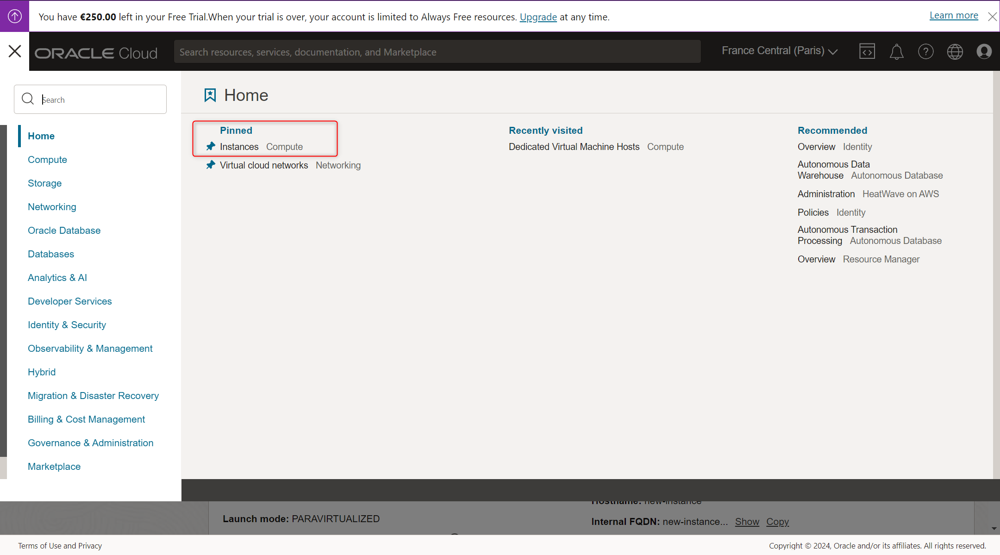
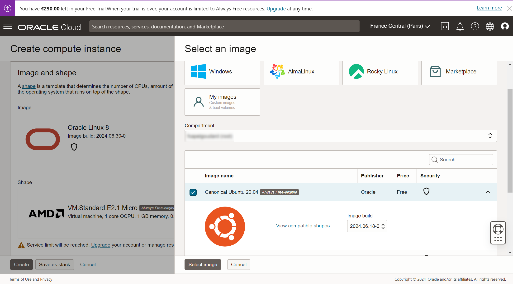
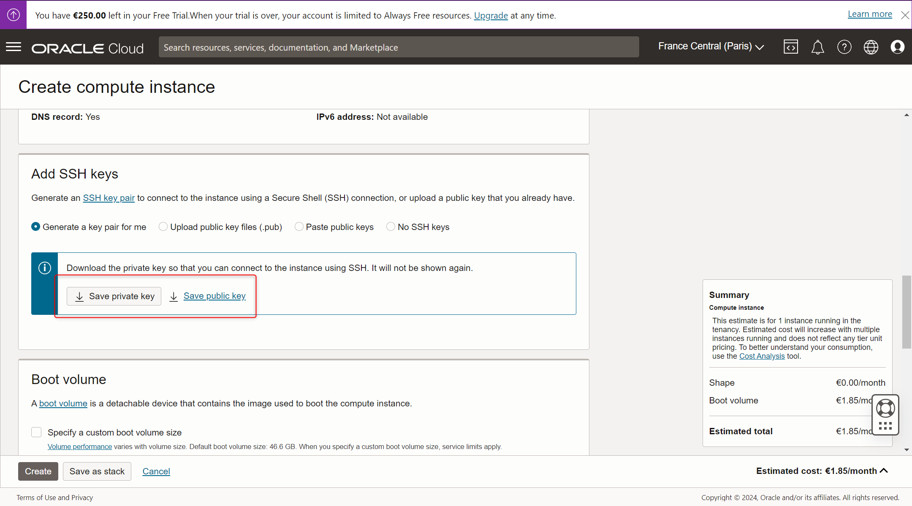

# Déploiement application web

Ce guide vous aide à déployer votre application web en utilisant 
une base de données Oracle. Suivez les étapes ci-dessous pour créer un 
compte Oracle, configurer une nouvelle instance Oracle dans le Cloud, et préparer votre environnement de développement.

## 1. Création d'un Compte Oracle

1. Rendez-vous sur le site d'Oracle à [https://www.oracle.com](https://www.oracle.com).


2. Cliquez sur "Se Connecter" en haut à droite et sélectionnez "Créer un Compte".


3. Remplissez le formulaire d'inscription avec vos informations personnelles.


4. Suivez les instructions pour vérifier et activer votre compte Oracle.


### Création d'une Instance Oracle Autonomous Database

1. Connectez-vous à votre compte Oracle Cloud sur [https://cloud.oracle.com](https://cloud.oracle.com).

2. Accédez au tableau de bord Oracle Cloud et choisissez "Créer une Instance".


3. Choisir Ubuntu 20.0.4 ou vérsion ultérieure comme image


4. Télécharger la clé privée pour se connecter en SSH
   

## Termius / Connexion SSH
1. Télecharger Termius :https://termius.com/

2. Hostname "ubuntu@ip_piblique" et mettre la clé privée

## Update/Upgrade instance
````sql
sudo apt update
sudo apt upgrade -y
````
## Installer et activer Apache2
````sql
sudo apt install apache2 -y
sudo systemctl start apache2
sudo systemctl enable apache2
````
##  MySQL
````sql
sudo apt install mysql-server -y
sudo mysql_secure_installation //sécuriser l'installation ' 
                               // suivre les étapes 
          
````
Créer BDD et tables : 

````sql

````

## Installer PHP
````sql
apt install php libapache2-mod-php php-mysql -y
sudo systemctl restart apache2 //restart apache
````
